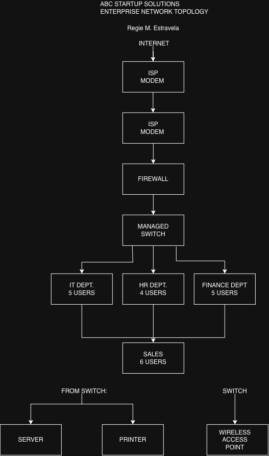

# Week 02 – Enterprise Infrastructure Planning

## Project Overview

This project presents the Enterprise Infrastructure Plan for ABC Startup Solutions, a newly established software development company with 20 employees. The company operates on a single office floor and has four departments: Information Technology, Human Resources, Finance, and Sales.

The project focuses on planning the company's IT infrastructure before purchasing and deploying equipment. It includes the company's hardware, software, network equipment, network topology, system administration roles, and infrastructure recommendations.

## Learning Objectives

Through this project, I practiced the following skills:

- Analyzing organizational IT requirements
- Preparing hardware, software, and network inventories
- Designing an enterprise network topology
- Understanding system administration roles
- Creating technical documentation using Markdown
- Planning secure and scalable IT infrastructure

## Company Scenario

ABC Startup Solutions is a software development company with 20 employees.

| Department | Employees |
|---|---:|
| Information Technology | 5 |
| Human Resources | 4 |
| Finance | 5 |
| Sales | 6 |
| **Total** | **20** |

The company initially has no computers, server, network, internet infrastructure, or security policies. The purpose of this project is to design the required IT infrastructure from the beginning.

## Hardware Inventory Summary

The planned hardware includes:

- 15 Desktop Computers
- 5 Laptops
- 1 Server
- 1 Router
- 1 Managed Switch
- 2 Printers
- 4 UPS Units
- 3 Wireless Access Points
- 1 NAS Storage
- 2 External Backup Drives
- 20 Monitors

These hardware resources were selected based on the company's 20 employees and the requirements of each department.

## Software Inventory Summary

The planned software includes:

- Windows 11 Pro
- Ubuntu Server 24.04 LTS
- Microsoft Office
- Visual Studio Code
- Git
- GitHub Desktop
- VirtualBox
- Google Chrome
- Microsoft Defender
- AnyDesk
- 7-Zip

These applications support software development, office productivity, system administration, security, remote support, and file management.

## Embedded Network Diagram

The enterprise network topology was designed using Draw.io.

The network follows this general structure:

**Internet → ISP Modem → Router → Firewall → Managed Switch**

The managed switch connects the IT, HR, Finance, and Sales departments, as well as the server, printer, and wireless access point.

**Network Diagram:**

## Technologies Used

- Windows 11 Pro
- Ubuntu Server
- Microsoft Office
- Git
- GitHub Desktop
- VirtualBox
- Network Router and Switch
- Firewall
- Wireless Networking
- NAS Storage
- Draw.io
- GitHub

## Challenges Encountered

One of the challenges I encountered was determining the appropriate hardware and network equipment for a startup company with 20 employees. I also had to consider how the different departments would connect to the network while keeping the infrastructure organized and secure.

Creating the network topology was another challenging part because the Internet, modem, router, firewall, switch, server, departments, printer, and wireless access point needed to be connected logically.

## Reflection

This project helped me understand that system administration requires proper planning before deploying IT infrastructure. I learned how to analyze business requirements and use them to determine the appropriate hardware, software, network equipment, security measures, and backup solutions.

I also learned that an effective infrastructure should not only meet the company's current needs but should also allow future expansion. This project improved my understanding of how different system administration roles work together and how technical decisions can support business operations.

## References

- LSPU ITEP 414 – System Administration and Maintenance, Week 2 Portfolio Project Module
- Draw.io – Network Diagram Design Tool
- GitHub – Repository and Version Control Platform
